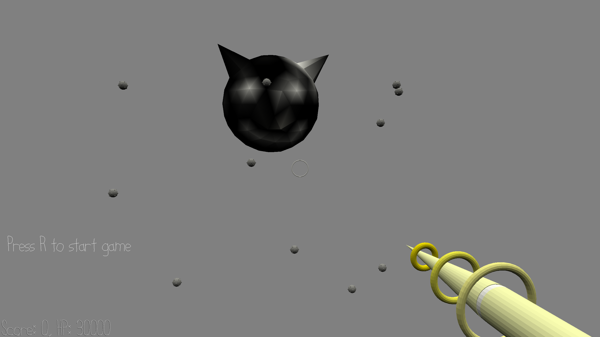

# Alien Bomber Conqueror Defence

Author: Sherwin JIN

Design: A FPS game which requires the player to make fast decisions on whether to shoot the further bomb to obtain a higher score, or shoot the closer bomb to minimize damage taken and stay alive longer.

Screen Shot:

How To Play:

Earth is under attack! Some aliens named "Bombers" from the planet "Bomb" are throwing tons of bombs to earth. You (as the player) are now earth's only hope. Move your mouse to aim the bombs, and left click to eliminate them. When a bomb is eliminated, it will **explode**, and causing damage if you are close (the closer you are, the more damage you will take). Everytime you eliminate a bomb, you obtain some points which are added to your score. The further the bomb is when you eliminate one, the more points you get. Try to stay a live longer and get a higher score!

This game was built with [NEST](NEST.md).
